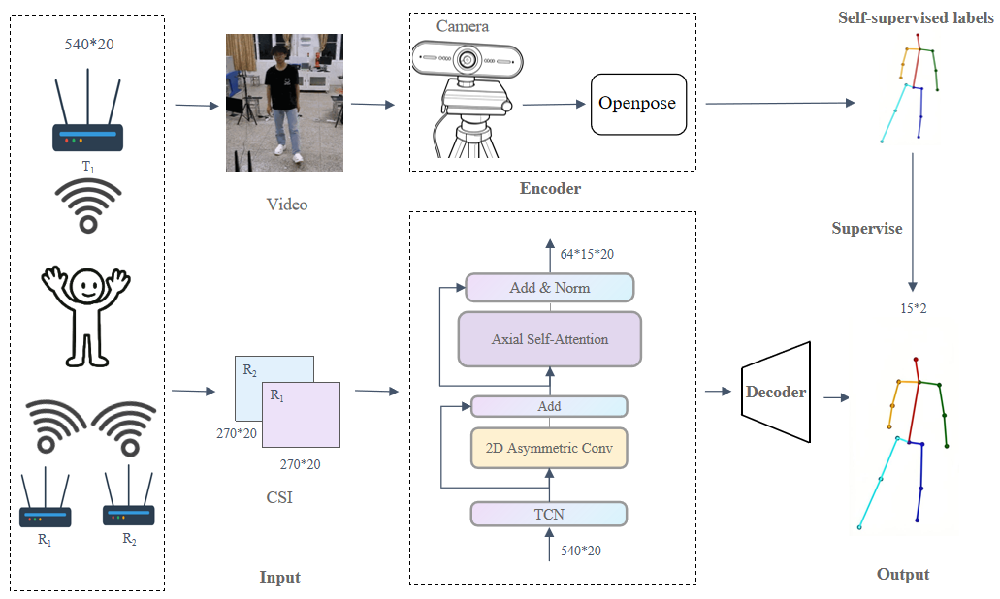

# WiFlow: Continuous Human Pose Estimation via WiFi Signals

Existing WiFi-based human pose estimation methods often focus on discrete pose sample evaluation. This work presents WiFlow, a novel framework for continuous human pose estimation using WiFi signals. Unlike vision-based approaches such as two-dimensional deep residual networks that treat Channel State Information (CSI) as images, WiFlow employs an encoder-decoder architecture. The encoder captures spatio-temporal features of CSI using temporal and asymmetric convolutions, preserving the original sequential structure of signals. It then refines keypoint features of human bodies to be tracked and capture their structural dependencies via axial attention. The decoder subsequently maps the encoded high-dimensional features into keypoint coordinates.

* [Architecture](#architecture)
* [Dataset](#dataset)
* [Usage](#usage)
* [Visualization](#visualization)
* [Result](#result)

---

## Architecture



---

## Dataset

**Download Link**: [https://kaggle.com/datasets/5dc84daab11fab92e4a98f4ecf9fbf5ab9a32ca0c101074b602e98b4b33e2222]

**Dataset Statistics**:
- Total Samples: 360,000 synchronized CSI-pose samples
- Subjects: 5
- Activities: walking, raising hands, squatting, hands up, kicking, waving, turning, and jumping
- Keypoints: 15 body joints
- CSI Dimensions: 540 × 20

---

## Usage

### Installation

Clone the repository:
```bash
git clone https://github.com/DY2434/WiFlow-WiFi-Pose-Estimation-with-Spatio-Temporal-Decoupling.git
cd yourrepo
```

### Setup Environment

Create virtual environment and install dependencies:
```bash
python3 -m venv env
source env/bin/activate  # On Windows: env\Scripts\activate
pip install -r requirements.txt
```

Available arguments:
- `--gpu`: GPU configuration (default: '0')
- `--batch_size`: Batch size (default: 64)
- `--epochs`: Number of training epochs (default: 50)
- `--lr`: Learning rate (default: 1e-4)
- `--output_dir`: Output directory for results (default: 'output')
- `--use_augmentation`: Enable data augmentation

### Training

Train the model with default parameters:
```bash
python run.py
```

### Testing

Trained models are automatically evaluated on the test set after training. Results are saved in the output directory including:
- Best model checkpoint: `best_pose_model.pth`
- Training history: `training_history.csv`
- Test predictions: `test_predictions.csv`
- Visualization videos in `videos/` folder

---

## Visualization

### Comparison with Ground Truth

<div align="center">
  
</div>

### Training Curves


---

### Visual comparison of OpenPose (top) and WiFlow (bottom) results


## Result

### Performance Comparison under Setting 1 (Random Split)

| Metric | **WiFlow (Ours)** | WPformer | WiSPPN | PerUnet | HPE-Li |
|---|---|---|---|---|---|
| **PCK@20** | **97.25%** | 70.02% | 85.87% | 86.11% | 93.79% |
| **PCK@30** | **98.63%** | 82.98% | 92.23% | 92.34% | 97.36% |
| **PCK@40** | **99.16%** | 89.33% | 95.52% | 95.45% | 98.68% |
| **PCK@50** | **99.48%** | 93.22% | 97.48% | 97.29% | 99.26% |
| **MPJPE (m)** | **0.007** | 0.028 | 0.016 | 0.016 | 0.011 |
| **Param (M)** | **2.23** | 10.04 | 121.50 | 309.09 | 0.83 |
| **FLOPs (B)** | **0.07** | 35.00 | 338.45 | 45.92 | 1.09 |
| **Training Time (h)** | **2.30** | 35.47 | 68.10 | 25.50 | 3.60 |

### Performance Comparison under Setting 2 (Cross-Subject / LOSO)

<table>
  <thead>
    <tr>
      <th rowspan="2"><b>Method</b></th>
      <th rowspan="2"><b>Test Subject</b></th>
      <th colspan="4"><b>Evaluation Metrics</b></th>
      <th rowspan="2"><b>Training Time (h)</b></th>
    </tr>
    <tr>
      <th><b>PCK@20</b></th>
      <th><b>PCK@30</b></th>
      <th><b>PCK@50</b></th>
      <th><b>MPJPE (m)</b></th>
    </tr>
  </thead>
  <tbody>
    <tr>
      <td rowspan="6"><b>WiFlow (Ours)</b></td>
      <td>Subject 1</td>
      <td>82.65</td>
      <td>91.54</td>
      <td>96.80</td>
      <td>0.023</td>
      <td>2.45</td>
    </tr>
    <tr>
      <td>Subject 2</td>
      <td>90.07</td>
      <td>96.38</td>
      <td>98.63</td>
      <td>0.016</td>
      <td>3.25</td>
    </tr>
    <tr>
      <td><b>Subject 3 (Hard)</b></td>
      <td><b>80.82</b></td>
      <td><b>89.79</b></td>
      <td><b>95.93</b></td>
      <td><b>0.025</b></td>
      <td><b>3.50</b></td>
    </tr>
    <tr>
      <td>Subject 4</td>
      <td>90.86</td>
      <td>95.57</td>
      <td>98.05</td>
      <td>0.016</td>
      <td>3.45</td>
    </tr>
    <tr>
      <td>Subject 5</td>
      <td>91.91</td>
      <td>96.78</td>
      <td>99.04</td>
      <td>0.017</td>
      <td>2.18</td>
    </tr>
    <tr>
      <td><b>Average (5-Fold)</b></td>
      <td><b>87.26</b></td>
      <td><b>94.01</b></td>
      <td><b>97.69</b></td>
      <td><b>0.019</b></td>
      <td><b>3.17</b></td>
    </tr>
    <tr>
      <td>WiSPPN</td>
      <td>Subject 3</td>
      <td>71.41</td>
      <td>82.52</td>
      <td>92.72</td>
      <td>0.028</td>
      <td>51.63</td>
    </tr>
    <tr>
      <td>WPformer</td>
      <td>Subject 3</td>
      <td>68.75</td>
      <td>81.06</td>
      <td>92.65</td>
      <td>0.030</td>
      <td>137.50</td>
    </tr>
    <tr>
      <td>PerUnet</td>
      <td>Subject 3</td>
      <td>7.70</td>
      <td>16.06</td>
      <td>35.82</td>
      <td>0.109</td>
      <td>33.40</td>
    </tr>
    <tr>
      <td>HPE-Li</td>
      <td>Subject 3</td>
      <td>79.67</td>
      <td>89.34</td>
      <td>95.48</td>
      <td>0.026</td>
      <td>3.70</td>
    </tr>
  </tbody>
</table>

*(Note: WiFlow was evaluated via 5-fold cross-validation. Baselines were evaluated on the most challenging Subject 3 due to high computational costs.)*

### Cross-Dataset Performance (MM-Fi Dataset)

| Method | PCK@20 | PCK@30 | PCK@40 | PCK@50 | MPJPE (m) | Param (M) |
|---|---|---|---|---|---|---|
| **WiFlow (Ours)** | **66.73%** | **78.35%** | **84.69%** | **88.46%** | **0.120** | **1.06** |
| HPE-Li | 57.35% | 71.70% | 80.16% | 85.74% | 0.138 | 2.06 |
| PerUnet | 38.11% | 56.13% | 68.62% | 77.00% | 0.193 | 303.97 |
| WiSPPN | 35.72% | 55.53% | 69.15% | 78.21% | 0.191 | 11.50 |
| WPformer | 38.54% | 59.73% | 72.30% | 80.24% | 0.183 | 26.52 |

### Ablation Study Results

| Model | PCK@10 | PCK@20 |
|---|---|---|
| **WiFlow (Ours)** | **91.36%** | **97.25%** |
| Replace TCN with regular 1D convolution | 84.20% | 96.44% |
| Replace TCN and Asym Conv with 2D res conv | 83.55% | 95.69% |
| Replace group conv with depthwise conv | 87.31% | 96.84% |
| Remove Axial Attention | 91.09% | 97.07% |

## License

[Apache License 2.0]

---